# 🎨 AI Drawing Recreator


An interactive web application where you draw something, and an AI attempts to recreate it using computer vision and reinforcement learning techniques!


## ✨ Features

- 🖌️ **Interactive Canvas** - Draw freely with mouse or touch input
- 🤖 **AI Recreation** - Watch as AI traces and recreates your drawing
- 📊 **Real-time Metrics** - See similarity scores and stroke count
- 🎨 **Customizable Tools** - Adjust brush size, colors, and drawing modes
- ⚡ **Fast Processing** - Lightweight neural network for quick inference
- 📱 **Responsive Design** - Works on desktop and mobile devices

## 🏗️ Architecture

```mermaid
graph TD
    A[👤 User Drawing] -->|Canvas Input| B[Image Processing]
    B -->|Resize & Convert| C[Edge Detection]
    C -->|Sobel Filter| D[Contour Analysis]
    D -->|Path Planning| E[AI Agent]
    E -->|Grid Actions| F[Stroke Generation]
    F -->|Draw Line| G[🤖 AI Canvas]
    G -->|Compare| H[Similarity Metrics]
    
    style A fill:#e1f5ff
    style E fill:#fff4e1
    style G fill:#e8f5e9
    style H fill:#f3e5f5
```



## 🔄 How It Works


## 🚀 Installation

### Prerequisites

- Python 3.8 or higher
- pip package manager

### Setup

1. **Clone the repository**
```bash
git clone https://github.com/yourusername/ai-drawing-recreator.git
cd ai-drawing-recreator
```

2. **Create a virtual environment** (recommended)
```bash
python -m venv venv
source venv/bin/activate  # On Windows: venv\Scripts\activate
```

3. **Install dependencies**
```bash
pip install -r requirements.txt
```

### Requirements

Create a `requirements.txt` file with:
```txt
streamlit>=1.28.0
numpy>=1.24.0
torch>=2.0.0
Pillow>=10.0.0
streamlit-drawable-canvas>=0.9.0
scipy>=1.11.0
```

## 🎮 Usage

1. **Start the application**
```bash
streamlit run app.py
```

2. **Open your browser**
   - The app will automatically open at `http://localhost:8501`

3. **Draw and create!**
   - Draw something on the left canvas
   - Click "Let AI Recreate!" button
   - Watch the AI recreate your drawing on the right

## 🎯 Tech Stack

```mermaid
graph LR
    A[🎨 Frontend] --> B[Streamlit]
    C[🧠 AI/ML] --> D[PyTorch]
    C --> E[NumPy]
    C --> F[SciPy]
    G[📊 Image Processing] --> H[Pillow/PIL]
    G --> I[OpenCV Techniques]
    
    style B fill:#ff4b4b
    style D fill:#ee4c2c
    style E fill:#013243
    style F fill:#0054a6
    style H fill:#4169e1
```



| Technology | Purpose |
|------------|---------|
|  | Web interface and UI components |
|  | Neural network framework |
|  | Numerical computing |
|  | Core programming language |

## 🧪 Key Components

### SimpleDrawingNetwork
A lightweight convolutional neural network designed for fast inference:
- 3 convolutional layers (32, 64, 128 filters)
- Fully connected layers with dropout
- Grid-based action space (16×16 grid + finish action)

### SimpleDrawingEnv
Custom environment for drawing simulation:
- 64×64 pixel canvas with 16×16 grid overlay
- Cursor-based navigation
- Stroke drawing with PIL
- State representation with cursor position

### Edge Detection Algorithm
Computer vision pipeline:
1. Convert drawing to grayscale
2. Apply Sobel edge detection
3. Extract edge points
4. Sample strategic points
5. Convert to grid coordinates
6. Generate drawing path

## 📊 Features Breakdown


## 🎓 Learning Resources

This project demonstrates:
- **Computer Vision**: Edge detection and image processing
- **Reinforcement Learning**: Agent-based drawing strategy
- **Neural Networks**: CNN architecture for state encoding
- **Web Development**: Interactive UI with Streamlit
- **Algorithm Design**: Path planning and optimization

## 🤝 Contributing

Contributions are welcome! Here are some ways you can help:

1. 🐛 Report bugs
2. 💡 Suggest new features
3. 📝 Improve documentation
4. 🔧 Submit pull requests

## 📝 License

This project is licensed under the MIT License - see the LICENSE file for details.

## 🙏 Acknowledgments

- Built with [Streamlit](https://streamlit.io/)
- Neural networks powered by [PyTorch](https://pytorch.org/)
- Canvas component from [streamlit-drawable-canvas](https://github.com/andfanilo/streamlit-drawable-canvas)

## 📧 Contact

Have questions or suggestions? Feel free to open an issue or reach out!

---

<div align="center">

**Made with ❤️ and AI**

⭐ Star this repo if you find it useful!

</div>
